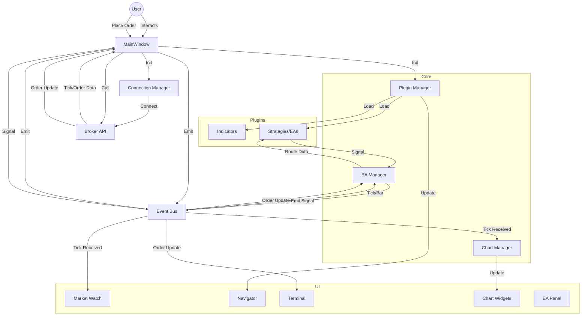

# Application Overview & Architecture

## Introduction
Welcome to the **MT5-Style Trading Platform**. This application is a comprehensive desktop trading platform built with **Python** and **PyQt5**. It mimics the layout and functionality of MetaTrader 5 (MT5) but is designed to work with custom brokers (currently configured for Shoonya API).

This document provides a high-level overview of the system architecture, data flow, and key components to help you get up to speed quickly.

## Architecture Pattern
The application follows a **Modular Event-Driven Architecture**.
- **Core Logic** is separated from **UI**.
- **Event Bus** handles communication between loosely coupled components.
- **Managers** (ChartManager, EAManager, ConnectionManager) handle specific domains of logic.
- **Broker Interface** abstracts the underlying trading API.

## Directory Structure

| Directory | Description |
|-----------|-------------|
| `main.py` | **Entry Point**. Initializes the application, loads config, and sets up the main window. |
| `core/` | **Business Logic**. Contains the EventBus, Managers (Chart, EA, Connection), and base classes. |
| `ui/` | **User Interface**. Contains all PyQt widgets (MainWindow, Charts, MarketWatch, Terminal, etc.). |
| `brokers/` | **Broker Adapters**. Contains the `Broker` interface and specific implementations (e.g., Shoonya). |
| `data/` | **Data Models**. Defines data classes like `Symbol`, `Order`, `OHLCData`. |
| `plugins/` | **Extensions**. Contains dynamic plugins: Indicators, Strategies (EAs), and Scripts. |
| `utils/` | **Utilities**. Helper modules for logging, configuration, and common functions. |

## Key Components

### 1. Main Window (`main.py` & `ui/main_window_ui.py`)
The central hub of the application. It:
- Initializes the `Broker`.
- Sets up the UI layout (Dock widgets, Central chart area).
- Instantiates Managers (`ChartManager`, `ConnectionManager`).
- Connects high-level signals (e.g., Menu actions).

### 2. Event Bus (`core/event_bus.py`)
The central nervous system. It is a Singleton `QObject` that defines application-wide signals.
- **Signals**: `tick_received`, `order_placed`, `candle_updated`, `ea_signal_generated`, etc.
- **Usage**: Components emit signals to the bus, and interested parties subscribe to them. This reduces direct dependencies between components.

### 3. Connection Manager (`core/connection_manager.py`)
Handles the lifecycle of the broker connection.
- Connects to the broker in a background thread.
- Sets up the initial wiring of Broker events to the `EventBus` or `MainWindow`.
- Manages connection status updates in the UI.

### 4. Chart Manager (`core/chart_manager.py`)
Manages the central tabbed area of charts.
- Creates and destroys `ChartWidget` instances.
- Handles timeframe changes and data fetching.
- Routes tick data to active charts for real-time updates.

### 5. EA Manager (`core/ea_manager.py`)
Manages Expert Advisors (Automated Trading Strategies).
- Registers, starts, stops, and pauses EAs.
- Routes market data (Ticks and Bars) to running EAs.
- Handles signals generated by EAs (Buy/Sell requests).

### 6. Plugin Manager (`core/plugin_manager.py`)
Responsible for extensibility.
- Scans the `plugins/` directory.
- Dynamically loads Python files for Indicators and Strategies.
- Registers them with the system so they appear in the **Navigator**.

## Data Flow Diagram

The following diagram illustrates how data flows through the system, from the Broker to the UI and EAs.

## Key Workflows

### 1. Application Startup
1.  `main.py` creates `MainWindow`.
2.  `MainWindow` loads `Config`.
3.  `MainWindow` initializes `UI` components.
4.  `MainWindow` initializes `EAManager` and `PluginManager`.
5.  `PluginManager` scans `plugins/` and populates `Navigator`.
6.  `ConnectionManager` connects to the Broker.

### 2. Real-Time Data Feed
1.  Broker receives a WebSocket tick.
2.  `MainWindow` (via callback) receives the tick.
3.  `MainWindow` emits `tick_received` to `EventBus`.
4.  `MarketWatch` updates the price list.
5.  `ChartManager` updates the active chart candles.
6.  `EAManager` passes the tick to running EAs for logic processing.

### 3. Order Execution
1.  User clicks "Buy" or EA generates a "Buy" signal.
2.  Request is sent to `Broker.place_order()`.
3.  Broker confirms order placement and returns an `Order` object.
4.  `MainWindow` emits `order_placed` to `EventBus`.
5.  `Terminal` adds the order to the "Trade" tab.
6.  `EAManager` is notified to track the position.

## Getting Started for Developers
1.  **Add a new Indicator**: Create a `.py` file in `plugins/indicators/` inheriting from `Indicator`.
2.  **Add a new Strategy**: Create a `.py` file in `plugins/strategies/` inheriting from `Strategy` (or `ExpertAdvisor`).
3.  **Modify UI**: Edit `ui/main_window_ui.py` or specific widget files in `ui/`.
4.  **Debug**: Use `utils.logger` for logging. Check `logs/app.log`.
